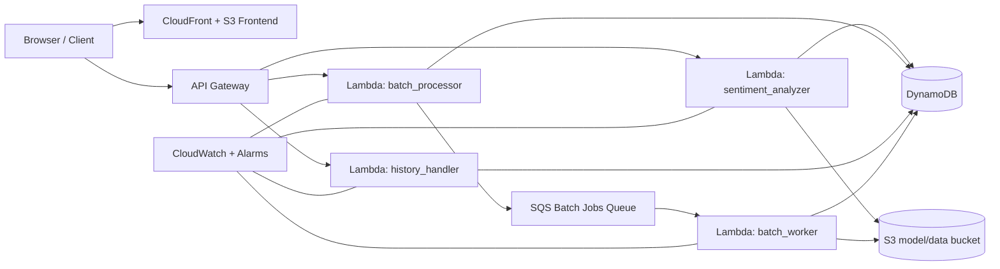

# Sentiment Analysis Platform

Minimal production-style serverless ML inference system on AWS.

It provides:
- Real-time sentiment inference (`/analyze`)
- Batch submission (`/batch` deployed, `/jobs` in backend code)
- History lookup (`/history`)
- Terraform-managed infrastructure and GitHub Actions CI/CD

## Architecture



## Prerequisites

- AWS account with CLI configured (`aws configure`)
- Python 3.11+
- Terraform 1.6+
- GitHub repository (for CI/CD option)

## Quick Start (Local)

Use this when you want to test API + frontend without AWS deployment.

```bash
cd /path/to/sentiment-analysis

python3 -m venv .venv
source .venv/bin/activate

pip install --upgrade pip
pip install -r requirements.txt
pip install -r backend/sentiment_analyzer/requirements.txt
pip install -r backend/batch_processor/requirements.txt
pip install -r backend/history/requirements.txt
pip install "optimum[onnxruntime]"

# Required once if backend/model_assets is empty
python export_onnx.py

python local_server.py

# In another terminal: serve frontend on localhost
cd frontend
python -m http.server 8080
```

Open http://localhost:8080 and keep **Local Testing** mode selected.

## Setup And Deploy (Terraform + Scripts)

### 1) Configure Terraform variables

```bash
cd sentiment-analysis-infrastructure
cp terraform.tfvars.example terraform.tfvars
```

Edit `terraform.tfvars` and set at minimum:
- `alert_email`
- optional tags and throttle values

### 2) Provision AWS infrastructure

```bash
terraform init
terraform apply
```

### 3) Build deployment config from Terraform outputs

```bash
cd ..
python update_config.py
```

### 4) Package and deploy application code

```bash
python deploy_all.py
```

This updates Lambda code, uploads model assets, updates frontend API URL, pushes frontend to S3, and invalidates CloudFront.

If you use AWS CLI locally, disable pager to avoid deploy output blocking:

```bash
export AWS_PAGER=""
```

### 5) Get public URLs

```bash
terraform -chdir=sentiment-analysis-infrastructure output -raw api_endpoint
terraform -chdir=sentiment-analysis-infrastructure output -raw cloudfront_url
```

## Deploy With GitHub Actions (CI/CD)

Workflows:
- `.github/workflows/ci.yml`: pytest + terraform validate on PRs
- `.github/workflows/deploy.yml`: Terraform apply + frontend deploy + basic `/analyze` smoke test on push to `main`

Required repository secrets:
- `AWS_ACCESS_KEY_ID`
- `AWS_SECRET_ACCESS_KEY`
- `ALERT_EMAIL`
- `THIRD_PARTY_API_KEY`

Optional repository variable:
- `AWS_REGION` (defaults to `us-west-2`)

Run deployment:
1. Push to `main`.
2. GitHub Actions runs deploy automatically.

Important: current deploy workflow does not run `deploy_all.py`, so it does not package/deploy full Lambda app code. Use manual deploy steps above for full backend deployment.

## API Endpoints

Base URL:

```bash
API_URL="$(terraform -chdir=sentiment-analysis-infrastructure output -raw api_endpoint)"
```

Current Terraform-exposed endpoints:
- `POST /analyze`
- `POST /batch`
- `GET /history`

Job-style endpoints in codebase:
- `POST /jobs` (backend code path)
- `GET /jobs/{id}` (handler exists)

Note: `POST /jobs` and `GET /jobs/{id}` are not yet wired in `api_gateway.tf` in current repo state.

## Example Requests And Responses

### 1) Analyze sentiment

```bash
curl -sS -X POST "$API_URL/analyze" \
    -H "Content-Type: application/json" \
    -d '{"text":"I absolutely love this service","user_id":"demo-user"}'
```

Example response:

```json
{
    "sentiment": "POSITIVE",
    "confidence": 0.85,
    "text_preview": "I absolutely love this service",
    "user_id": "demo-user",
    "model_version": "1.0.0"
}
```

### 2) Submit a batch (current deployed path)

```bash
curl -sS -X POST "$API_URL/batch" \
    -H "Content-Type: application/json" \
    -d '{"texts":["good","bad"],"user_id":"demo-user","batch_id":"demo-batch-1"}'
```

Example response:

```json
{
    "batch_id": "demo-batch-1",
    "total_rows": 2,
    "success_count": 2,
    "failed_count": 0,
    "status": "COMPLETED"
}
```

### 3) Submit a batch (jobs-style target)

```bash
curl -sS -X POST "$API_URL/jobs" \
    -H "Content-Type: application/json" \
    -d '{"input_mode":"inline","texts":["good","bad"],"user_id":"demo-user"}'
```

Example response:

```json
{
    "job_id": "job-1712800000-ab12cd34",
    "status": "QUEUED",
    "model_version": "v1.0"
}
```

### 4) Read history

```bash
curl -sS "$API_URL/history?user_id=demo-user&limit=10"
```

Example response:

```json
{
    "user_id": "demo-user",
    "count": 2,
    "history": [
        {
            "type": "ANALYSIS",
            "text": "I absolutely love this service",
            "sentiment": "POSITIVE",
            "confidence": 0.998
        }
    ]
}
```

## Copy-Paste Command List

### Local run

```bash
cd /path/to/sentiment-analysis
python3 -m venv .venv
source .venv/bin/activate
pip install --upgrade pip
pip install -r requirements.txt
pip install -r backend/sentiment_analyzer/requirements.txt
pip install -r backend/batch_processor/requirements.txt
pip install -r backend/history/requirements.txt
pip install "optimum[onnxruntime]"
python export_onnx.py
python local_server.py

cd frontend
python -m http.server 8080
```

### Terraform deploy

```bash
cd /path/to/sentiment-analysis/sentiment-analysis-infrastructure
cp terraform.tfvars.example terraform.tfvars
terraform init
terraform apply

cd ..
python update_config.py
export AWS_PAGER=""
python deploy_all.py
```

### Online smoke test

```bash
API_URL="$(terraform -chdir=sentiment-analysis-infrastructure output -raw api_endpoint)"

curl -sS -X POST "$API_URL/analyze" \
    -H "Content-Type: application/json" \
    -d '{"text":"CI smoke test: looks great","user_id":"smoke"}'

curl -sS -X POST "$API_URL/jobs" \
    -H "Content-Type: application/json" \
    -d '{"input_mode":"inline","texts":["one","two"],"user_id":"smoke"}' \
    || curl -sS -X POST "$API_URL/batch" \
        -H "Content-Type: application/json" \
        -d '{"texts":["one","two"],"user_id":"smoke","batch_id":"smoke-batch"}'

curl -sS "$API_URL/history?user_id=smoke&limit=10"
```

### Tests

```bash
python3 -m venv .venv-tests
source .venv-tests/bin/activate
python -m pip install --upgrade pip
pip install pytest moto boto3
pytest -q tests
```

## Missing Steps / Known Gaps

- `backend/model_assets` is empty in current repo state; run `python export_onnx.py` before local runs and before first deploy.
- `export_onnx.py` requires Optimum ONNX tooling; install with `pip install "optimum[onnxruntime]"` if missing.
- Terraform API Gateway currently exposes `/batch`, but CI smoke test prefers `/jobs` first.
- `GET /jobs/{id}` handler exists in backend but is not yet connected in Terraform API Gateway resources.
- Deploy workflow currently provisions infra + frontend only; run `python deploy_all.py` to push full Lambda application packages.

## Cleanup

```bash
cd sentiment-analysis-infrastructure
terraform destroy
```
