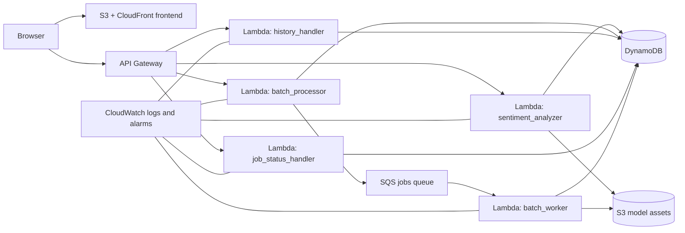

# Sentiment Analysis Platform

Minimal production-style sentiment inference system built with Python, AWS Lambda, API Gateway, SQS, DynamoDB, S3, CloudFront, and Terraform.

This repo supports four distinct workflows:

- Local development: run the Flask API and static frontend on localhost.
- CI/CD deployment: primary supported AWS deployment path through GitHub Actions.
- Infrastructure deployment: manage AWS resources with Terraform.
- Troubleshooting: fix the common failure modes that show up in local export and deploy steps.

## Architecture



If Mermaid does not render in your viewer, the deployed shape is: frontend on S3 and CloudFront, API on API Gateway, synchronous inference on Lambda, async job execution through SQS plus a worker Lambda, persistence in DynamoDB, and model assets in S3.

## Project Overview

- `POST /analyze` runs single-text sentiment inference.
- `POST /batch` processes direct text input or an S3-backed batch payload, but deployed behavior depends on the current Lambda packaging path.
- `GET /history` returns stored user or batch history.
- `GET /jobs/{id}` is wired in Terraform for job-status lookup, but deployed behavior depends on the current Lambda packaging path.
- `POST /jobs` exists in backend code but is not currently exposed by API Gateway.

## Prerequisites

- Python 3.11+
- Terraform 1.6+
- AWS CLI configured for the target account
- GitHub repository access if you use the supported CI/CD path

## Quick Start

This is the shortest working local path.

```bash
cd /Users/spartan/Dev/school/Cloud/sentiment-analysis

python3 -m venv .venv
source .venv/bin/activate

python3 -m pip install --upgrade pip
python3 -m pip install -r requirements.txt
python3 -m pip install -r backend/sentiment_analyzer/requirements.txt
python3 -m pip install -r backend/batch_processor/requirements.txt
python3 -m pip install -r backend/history/requirements.txt

# Terminal 1
python3 local_server.py

# Terminal 2
python3 -m http.server 8080 --directory frontend
```

Open `http://localhost:8080`.

Do not open `frontend/index.html` with `file://`. The frontend must be served from localhost so browser requests can reach the local API correctly.

## Local Development

### 1. Install local dependencies

```bash
cd /Users/spartan/Dev/school/Cloud/sentiment-analysis
python3 -m venv .venv
source .venv/bin/activate
python3 -m pip install --upgrade pip
python3 -m pip install -r requirements.txt
python3 -m pip install -r backend/sentiment_analyzer/requirements.txt
python3 -m pip install -r backend/batch_processor/requirements.txt
python3 -m pip install -r backend/history/requirements.txt
```

### 2. Optional: prepare ONNX model assets for local inference

The local server can still run without exported model assets. If `backend/model_assets` is missing, the shared model loader falls back to a simple local analyzer. If you want the real ONNX model locally, install the export dependencies and run the export script.

```bash
cd /Users/spartan/Dev/school/Cloud/sentiment-analysis
source .venv/bin/activate
python3 -m pip install -r requirements-export.txt
python3 export_onnx.py
```

Notes:

- `requirements-export.txt` includes `optimum[onnxruntime]`, which is required for export.
- `python3 export_onnx.py` is safe to rerun. It skips export if the required assets already exist and exports them when they are missing or incomplete.

### 3. Start the local API and frontend

```bash
cd /Users/spartan/Dev/school/Cloud/sentiment-analysis
source .venv/bin/activate

# Terminal 1
python3 local_server.py

# Terminal 2
python3 -m http.server 8080 --directory frontend
```

Local endpoints:

- API: `http://localhost:5000`
- Frontend: `http://localhost:8080`
- Health: `http://localhost:5000/health`

### 4. Local smoke tests

```bash
curl -sS -X POST http://localhost:5000/analyze \
  -H "Content-Type: application/json" \
  -d '{"text":"I love this!","user_id":"local-demo"}'
```

```bash
curl -sS -X POST http://localhost:5000/batch \
  -H "Content-Type: application/json" \
  -d '{"texts":["great","awful"],"user_id":"local-demo"}'
```

```bash
curl -sS "http://localhost:5000/history?user_id=local-demo&limit=10"
```

## CI/CD Deployment

GitHub Actions is the primary supported AWS deployment path.

Workflow files:

- `.github/workflows/ci.yml`: runs `pytest` and `terraform validate` on pull requests.
- `.github/workflows/deploy.yml`: exports model assets when needed, applies Terraform, runs `update_config.py`, runs `deploy_all.py`, and smoke-tests `POST /analyze` on pushes to `main`.

### Required GitHub secrets

- `AWS_ACCESS_KEY_ID`
- `AWS_SECRET_ACCESS_KEY`
- `TF_STATE_BUCKET`
- `ALERT_EMAIL`
- `THIRD_PARTY_API_KEY`

### Optional GitHub variable

- `AWS_REGION` with default `us-west-2`

### Supported deploy flow

```bash
git checkout main
git pull
git push origin main
```

What the deploy workflow does:

1. Restores or exports `backend/model_assets`.
2. Validates exported assets with `python3 export_onnx.py --validate`.
3. Runs `terraform init`, `plan`, and `apply`.
4. Runs `python3 update_config.py` to generate `deploy_config.json` from Terraform outputs.
5. Runs `python3 deploy_all.py` to package Lambda code, upload model assets, update `frontend/config.js`, upload frontend files, and invalidate CloudFront.
6. Smoke-tests `POST /analyze`.

The intended supported deploy path is GitHub Actions. Current deploy coverage is still narrower than the full Terraform surface:

- `deploy_all.py` only refreshes the functions listed in `deploy_config.json`
- `deploy_config.json` currently omits `batch_worker` and `job_status_handler`
- the checked-in batch deploy mapping points at `batch_handler.py`, while Terraform configures the deployed `batch_processor` Lambda with `batch_submitter.lambda_handler`

Because of that, the CI workflow fully validates the `POST /analyze` path, while `/batch` and `/jobs/{id}` should be treated as routes that still depend on deploy-script alignment.

## Infrastructure Deployment

Use this when you need to bootstrap, inspect, or manually update infrastructure. Infrastructure changes should stay in Terraform.

Before manual AWS CLI or deploy commands, disable the pager so the CLI does not block interactive or scripted output:

```bash
export AWS_PAGER=""
```

### 1. Initialize Terraform variables

```bash
cd /Users/spartan/Dev/school/Cloud/sentiment-analysis/sentiment-analysis-infrastructure
cp terraform.tfvars.example terraform.tfvars
```

Edit `terraform.tfvars` and set the required values.

### 2. Apply infrastructure locally

```bash
cd /Users/spartan/Dev/school/Cloud/sentiment-analysis/sentiment-analysis-infrastructure
export AWS_PAGER=""
terraform init
terraform plan
terraform apply
```

### 3. Refresh local deploy config from Terraform outputs

```bash
cd /Users/spartan/Dev/school/Cloud/sentiment-analysis
source .venv/bin/activate
python3 update_config.py
```

### 4. Optional: manually package and deploy application code

Use this only when you are intentionally bypassing GitHub Actions.

```bash
cd /Users/spartan/Dev/school/Cloud/sentiment-analysis
source .venv/bin/activate
export AWS_PAGER=""
python3 deploy_all.py
```

This script:

- uploads `backend/model_assets` if present
- packages and updates the Lambda functions listed in `deploy_config.json`
- rewrites `frontend/config.js` with the live API URL
- uploads frontend files to S3
- invalidates CloudFront

### 5. Read deployed URLs

```bash
terraform -chdir=/Users/spartan/Dev/school/Cloud/sentiment-analysis/sentiment-analysis-infrastructure output -raw api_endpoint
```

```bash
terraform -chdir=/Users/spartan/Dev/school/Cloud/sentiment-analysis/sentiment-analysis-infrastructure output -raw cloudfront_url
```

## API Endpoints

Set the base URL after Terraform apply:

```bash
API_URL="$(terraform -chdir=/Users/spartan/Dev/school/Cloud/sentiment-analysis/sentiment-analysis-infrastructure output -raw api_endpoint)"
```

Defined in API Gateway:

- `POST /analyze`
- `POST /batch`
- `GET /history`
- `GET /jobs/{id}`

Implemented in code but not currently exposed through API Gateway:

- `POST /jobs`

That distinction matters when you test against the deployed API. Route exposure depends on the Terraform and API Gateway wiring, not only on backend handlers existing in the repo. In the current repo state, `POST /analyze` is the only route covered by the CI smoke test, and `/batch` plus `/jobs/{id}` also depend on the Lambda packaging alignment described above.

## Example Requests And Responses

### Analyze

Request:

```bash
curl -sS -X POST "$API_URL/analyze" \
  -H "Content-Type: application/json" \
  -d '{"text":"I absolutely love this service","user_id":"demo-user"}'
```

Example response:

```json
{
  "user_id": "demo-user",
  "sentiment": "POSITIVE",
  "confidence": 0.99,
  "model_version": "1.0.0",
  "timestamp": 1712890000,
  "text_preview": "I absolutely love this service",
  "db_save_status": {
    "success": true
  }
}
```

### Batch

This reflects the backend handler contract. Verify the deployed Lambda packaging before relying on this route in AWS.

Request:

```bash
curl -sS -X POST "$API_URL/batch" \
  -H "Content-Type: application/json" \
  -d '{"texts":["great product","bad support"],"user_id":"demo-user","batch_id":"demo-batch-1"}'
```

Example response:

```json
{
  "batch_id": "demo-batch-1",
  "total_rows": 2,
  "success_count": 2,
  "failed_count": 0,
  "status": "COMPLETED"
}
```

### History

Request:

```bash
curl -sS "$API_URL/history?user_id=demo-user&limit=10"
```

Example response:

```json
{
  "user_id": "demo-user",
  "count": 1,
  "history": [
    {
      "type": "ANALYSIS",
      "text": "I absolutely love this service",
      "sentiment": "POSITIVE",
      "confidence": 0.99,
      "timestamp": 1712890000,
      "created_at": "2026-04-12T10:00:00"
    }
  ]
}
```

### Job status

This reflects the intended API shape. Verify the deployed Lambda packaging before relying on this route in AWS.

Request:

```bash
curl -sS "$API_URL/jobs/job-1712890000-ab12cd34"
```

Example response:

```json
{
  "job_id": "job-1712890000-ab12cd34",
  "status": "COMPLETED",
  "progress": {
    "processed_rows": 2,
    "total_rows": 2,
    "success_count": 2,
    "failed_count": 0,
    "percent": 100
  },
  "result_location": "dynamodb://sentiment-analytics/JOB#job-1712890000-ab12cd34",
  "model_version": "1.0.0"
}
```

## Command Reference

### Local development

```bash
cd /Users/spartan/Dev/school/Cloud/sentiment-analysis
python3 -m venv .venv
source .venv/bin/activate
python3 -m pip install --upgrade pip
python3 -m pip install -r requirements.txt
python3 -m pip install -r backend/sentiment_analyzer/requirements.txt
python3 -m pip install -r backend/batch_processor/requirements.txt
python3 -m pip install -r backend/history/requirements.txt
python3 local_server.py
```

```bash
cd /Users/spartan/Dev/school/Cloud/sentiment-analysis
python3 -m http.server 8080 --directory frontend
```

### Local ONNX export

```bash
cd /Users/spartan/Dev/school/Cloud/sentiment-analysis
source .venv/bin/activate
python3 -m pip install -r requirements-export.txt
python3 export_onnx.py
```

### Manual Terraform apply

```bash
cd /Users/spartan/Dev/school/Cloud/sentiment-analysis/sentiment-analysis-infrastructure
export AWS_PAGER=""
cp terraform.tfvars.example terraform.tfvars
terraform init
terraform plan
terraform apply
```

### Manual application deploy

```bash
cd /Users/spartan/Dev/school/Cloud/sentiment-analysis
source .venv/bin/activate
export AWS_PAGER=""
python3 update_config.py
python3 deploy_all.py
```

### Deployed smoke test

```bash
API_URL="$(terraform -chdir=/Users/spartan/Dev/school/Cloud/sentiment-analysis/sentiment-analysis-infrastructure output -raw api_endpoint)"
curl -sS -X POST "$API_URL/analyze" \
  -H "Content-Type: application/json" \
  -d '{"text":"CI smoke test: looks great","user_id":"smoke"}'
```

## Troubleshooting

### Frontend opened with `file://`

Problem: the browser opens `frontend/index.html` directly and requests do not behave like the supported local workflow.

Fix:

```bash
cd /Users/spartan/Dev/school/Cloud/sentiment-analysis
python3 -m http.server 8080 --directory frontend
```

Then open `http://localhost:8080`.

### `backend/model_assets` is missing

Problem: local ONNX assets are not present.

Reality:

- Local development still works because the shared loader falls back to a simple analyzer when no local model bucket is configured.
- CI deployment prepares model assets automatically when the model cache is cold.
- If you want real ONNX inference locally, export the assets explicitly.

Fix:

```bash
cd /Users/spartan/Dev/school/Cloud/sentiment-analysis
source .venv/bin/activate
python3 -m pip install -r requirements-export.txt
python3 export_onnx.py
```

### Model export failed

Problem: `python3 export_onnx.py` exits with an error.

Checks:

- confirm the virtual environment is active
- reinstall the export dependencies
- rerun validation after export

Commands:

```bash
cd /Users/spartan/Dev/school/Cloud/sentiment-analysis
source .venv/bin/activate
python3 -m pip install --upgrade pip
python3 -m pip install -r requirements-export.txt
python3 export_onnx.py --clean
python3 export_onnx.py --validate
```

### Missing Optimum ONNX dependency

Problem: import errors mention `optimum` or `optimum.onnxruntime`.

Fix:

```bash
cd /Users/spartan/Dev/school/Cloud/sentiment-analysis
source .venv/bin/activate
python3 -m pip install "optimum[onnxruntime]"
```

Or install the pinned export dependency set:

```bash
python3 -m pip install -r requirements-export.txt
```

### AWS CLI output is blocked by the pager

Problem: deploy commands appear stuck because the AWS CLI opened a pager.

Fix:

```bash
export AWS_PAGER=""
```

Set that before running `terraform`, `update_config.py`, `deploy_all.py`, or direct `aws` commands during manual deployment.

### `/jobs` request returns not found

Problem: `POST /jobs` is implemented in backend code but not reachable in the deployed API.

Fix:

- use `POST /batch` for the currently exposed batch-submit route
- use `GET /jobs/{id}` only if the route is present in the current Terraform deployment
- update Terraform and API Gateway wiring if you want `POST /jobs` exposed

### `/batch` or `/jobs/{id}` behaves differently than the README examples

Problem: Terraform defines the route, but the deployed Lambda code does not match the documented handler behavior.

Current repo limitation:

- `deploy_all.py` packages only the functions listed in `deploy_config.json`
- `deploy_config.json` does not include `batch_worker` or `job_status_handler`
- the batch Lambda deploy mapping does not currently match the Terraform handler name

What to check:

```bash
cd /Users/spartan/Dev/school/Cloud/sentiment-analysis
python3 update_config.py
cat deploy_config.json
```

Treat `POST /analyze` as the currently smoke-tested deployed endpoint until the batch and job-status packaging paths are aligned.

## What Was Corrected

- Clarified that the frontend must be served from localhost, not opened directly from `file://`.
- Moved AWS deployment guidance toward GitHub Actions as the primary supported path.
- Separated local development, CI/CD deployment, infrastructure deployment, and troubleshooting into distinct sections.
- Removed stale wording that implied every backend route in code was already exposed publicly.
- Documented that `GET /jobs/{id}` is wired, while `POST /jobs` is not currently exposed.
- Added the current deploy-script limitation: CI smoke-tests `POST /analyze`, but batch and job-status deployment still depend on package alignment.
- Updated model export guidance to call out `optimum[onnxruntime]`, `requirements-export.txt`, and the safe rerun behavior of `export_onnx.py`.
- Added explicit `AWS_PAGER=""` guidance for manual deploy and AWS CLI steps.